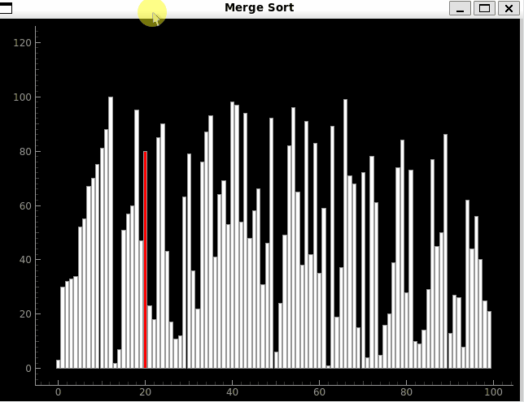
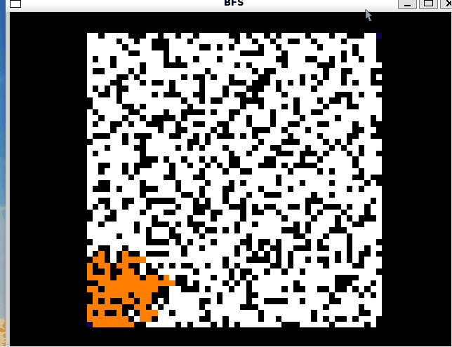
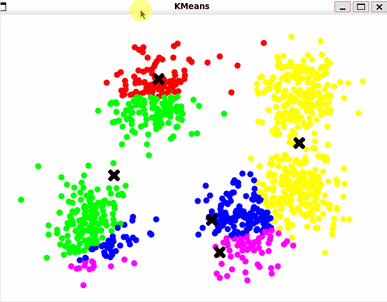

# Algorithm Visualizer

Visualizador de algoritmos usando **PyQt5** y **PyQtGraph**.

Este proyecto permite ver paso a paso cómo funcionan diferentes algoritmos mostrándolos en tiempo real.

## Demo

| Sorting (Merge Sort) | Pathfinding (BFS) | Clustering (K-Means) |
| :---: | :---: | :---: |
|  |  |  |

## Instalación y ejecución

```bash
pip install -r requirements.txt
python3 main.py
```

## Algoritmos implementados

### Algoritmos de Sorting

| Nombre | Complejidad | Memoria |
| --- | --- | --- |
| Bubble Sort | O(n^2) | O(1) |
| Cocktail Sort | O(n^2) | O(1) |
| Insertion Sort | O(n^2) | O(1) |
| Selection Sort | O(n^2) | O(1) |
| Gnome Sort | O(n^2) | O(1) |
| Pancake Sort | O(n^2) | O(1) |
| Merge Sort | O(n log n) | O(n) |
| Quick Sort | O(n log n) | O(log n) |
| Heap Sort | O(n log n) | O(1) |
| Comb Sort | O(n log n) | O(1) |
| Bucket Sort | O(n) | O(n) |
| Counting Sort | O(n+k) | O(n+k) |
| Radix Sort | O(n · k) | O(n) |
| Shell Sort | O(n^1.25) | O(1) |
| Bogo Sort | O(n · n!) / no termina | O(1) |
| Random Sort | O(n!) / no termina | O(1) |

> **Leyenda:** **n** = Tamaño del Vector.

### Algoritmos de Pathfinding

| Nombre | Complejidad (Peor caso) | Memoria |
| --- | --- | --- |
| BFS (Breadth-First Search) | O(V + E) | O(V) |
| DFS (Depth-First Search) | O(V + E) | O(V) |
| A* (A Star) | O(E) | O(V) |
| Greedy Best-First Search | O(V^2) | O(V) |
| Bidireccional BFS | O(b^(d/2)) | O(b^(d/2)) |

> **Leyenda:** **V** = Vértices, **E** = Aristas, **b** = Factor de ramificación (vecinos promedio), **d** = Distancia al objetivo.

### Algoritmos de Clustering

| Nombre | Complejidad | Memoria |
| --- | --- | --- |
| K-Means | O(n · k · i · d) | O(n+k) |
| DBSCAN | O(n^2) | O(n) |
| Hierarchical Clustering | O(n^3) | O(n^2) |
| Mean Shift | O(n^2 · i) | O(n) |

> **Leyenda:** **n** = Tamaño de Datos, **k** = clusters, **i** = iteraciones, **d** = dimensiones.
