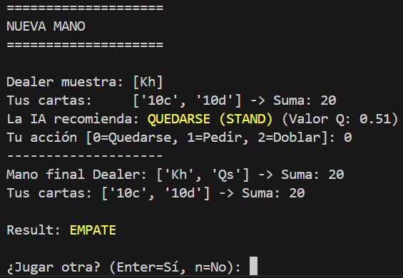
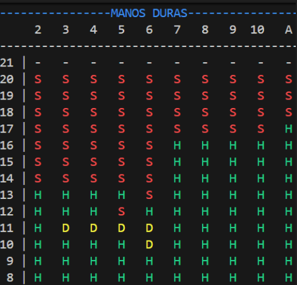
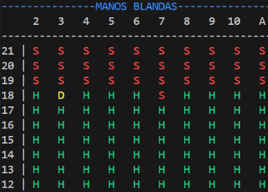

# Blackjack Reinforcement Learning (From Scratch)

Una implementación de un agente de **Reinforcement Learning** que aprende a jugar al Blackjack de manera óptima.

Este proyecto ha sido desarrollado desde cero, sin utilizar librerías de Machine Learning externas, implementando puramente la lógica matemática del algoritmo.

---

## Características Principales

* **Motor de Juego Propio:** Entorno de simulación (`BlackjackEnv`) que replica las reglas del Casino.
* **Espacio de Estados:** La IA distingue entre manos **Duras** y **Blandas**, y sabe cuándo es legal Doblar.
* **Mecánicas:** Soporte para acciones **Hit**, **Stand** y **Double**.
* **Algoritmo Q-Learning:** Implementación manual de la Ecuación de Bellman.
* **Asesor Interactivo (UI):** Un modo de juego donde tú te enfrentas al Dealer y la IA te aconseja  basándose en su entrenamiento.
* **Analítica:** Script de visualización para comprobar la **Tabla de Estrategia** aprendida por la IA.

---

## La Ciencia detrás del Proyecto

El agente no conoce las reglas inicialmente. Aprende jugando millones de partidas contra sí mismo mediante ensayo y error.

### El Estado

La IA observa el juego a través de una tupla de 4 dimensiones:

```python
(Player_Sum, Dealer_Card, Usable_Ace, Can_Double)
```

### Las Acciones

* 0: **Quedarse** (Stand)
* 1: **Pedir** (Hit)
* 2: **Doblar** (Double)

### La Ecuación de Bellman

El "cerebro" se actualiza tras cada decisión usando la siguiente fórmula:

```python
new_value = old_value + learning_rate * (reward + (discount_factor * max_future_q) - old_value)
```

## Ejecución

* **1: Entrenar al Agente** -> ```python3 training.py``` (puedes cambiar el nº de episodios para que acabe antes)
* **2: Jugar con la AI** -> ```python3 play.py```

<div align="center">


</div>

* **3: Ver la Tabla de Estrategia** -> ```python3 table.py```

## Resultados

<div align="center">

### Manos Duras
*(Sin As o con As que vale 1)*<br>


### Manos Blandas
*(Con As usable que vale 11)*<br>

</div>
