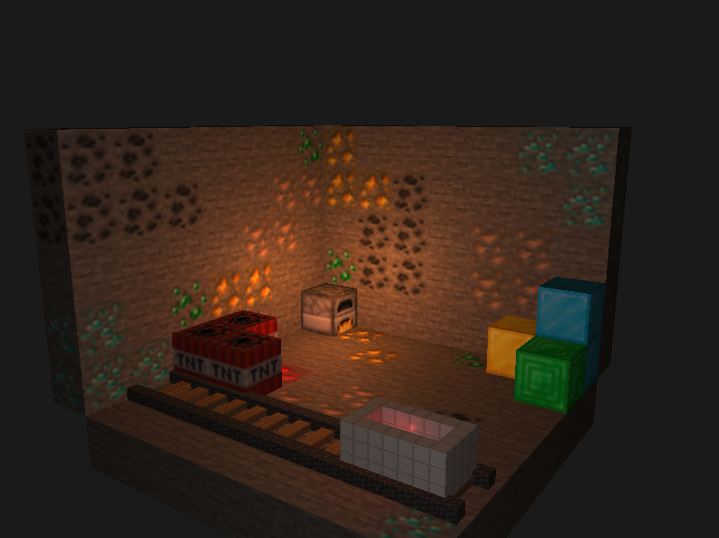

# Proyecto OpenGL – Minecraft-Like Lighting Demo

Este proyecto es una demo 3D escrita en **C++ y OpenGL**, que muestra:
- Sistema de **iluminación Phong** con múltiples point lights (horno, redstone y cámara)
- Texturas estilo Minecraft
- Shaders personalizados
- Movimiento de cámara

## Preview


## Características principales

### Iluminación dinámica
- Horno encendido con luz cálida y atenuación realista  
- Redstone brillante con tono rojizo  
- Linterna de cámara ajustable  
- Atenuación mediante `constant`, `linear` y `quadratic`

### Controles
- Ratón para rotación de la cámara
- `ESC` para salir  
- `F` para encender/apagar el horno
- `C` para encender/apagar la luz de la cámara
- `V` para encender/apagar la luz de la redstone
- `-> / <-` para mover la vagoneta

## Dependencias

Este proyecto requiere las siguientes librerías:

- **GLFW** – Creación de ventana y manejo de input  
- **GLAD** – Carga de funciones OpenGL  
- **GLM** – Matemáticas 3D  
- **STB Image** – Cargar texturas  

## Compilación

```bash
cmake .
make
./gl-scrapbook
```
### Texturas 

Las texturas utilizadas en este proyecto son propiedad de Mojang Studios ©.
Se incluyen únicamente con fines educativos.
Si es necesario retirarlas por motivos de copyright, pueden ser eliminadas sin problema.