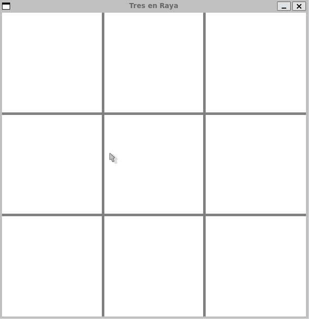

# Tres en Raya (Tic-Tac-Toe) - Versión gráfica

Este repositorio contiene la implementación del juego clásico Tres en Raya (Tic-Tac-Toe) en C++ utilizando la librería **SFML**.

Este proyecto reutiliza la lógica de la versión de terminal separando la lógica del programa de la capa de presentación.

---

## Características Principales

* **Motor Gráfico:** Renderizado 2D mediante SFML.
* **Inteligencia Artificial:** Implementación completa del algoritmo **Minimax**.
* **Arquitectura:** Diseño modular. La lógica del juego ignora que está siendo pintada en una ventana gráfica.

## Demo Visual



---

## Compilación y Ejecución

Requisitos: `g++`, `make` y `sfml`.

1. **Compilar (Usando el Makefile):**

    ```bash
    make
    ```

2. **Ejecutar el Juego:**

    ```bash
    ./TicTacToeUI
    ```

---

## Estructura y Documentación Técnica

La lógica de la IA y las funciones principales del juego están completamente documentadas usando el estándar **Doxygen**.

| Archivo | Contenido Principal |
| :--- | :--- |
| `main.cc` | Punto de entrada del programa. |
| `game.cc` / `game.hh` | Lógica pura del juego y algoritmo **Minimax**. |
| `UI_game.cc` / `UI_game.hh` | Diseño de la interfaz gráfica con SFML. |
| `Makefile` | Reglas de compilación y enlace. |

### Enlace a la Documentación (Doxygen)

Para una vista detallada de todas las funciones, el flujo de la IA y el renderizado descargue el repositorio y acceda al archivo:

[**[Ver Documentación Técnica Completa Aquí]**](html/index.html)
